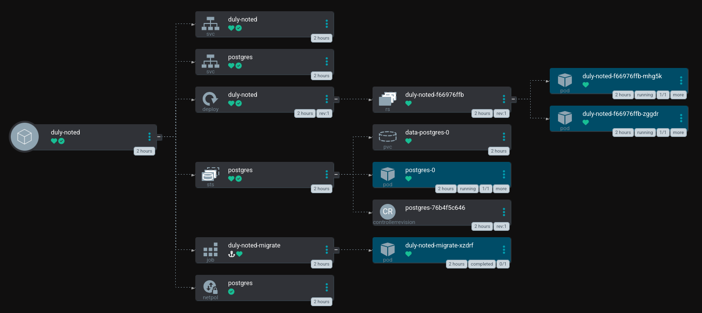
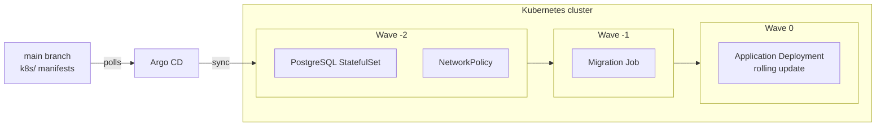
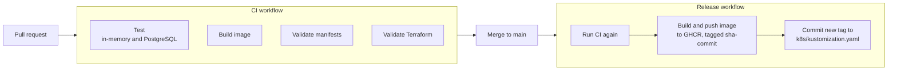

# DevOps pipeline for a todo web application with GitOps deployment

Harry Eriksson (guerikss@kth.se) and Villiam Riegler (villiamr@kth.se)
DD2482 DevOps, project report, October 2026

## Introduction

Duly Noted is a small todo web application. It is built on an
[Express](https://expressjs.com/) backend with a static frontend and stores
its todo items in [PostgreSQL](https://www.postgresql.org/). The application
is kept small on purpose because the focus of the project is the DevOps
pipeline around it.

The application runs in a local Kubernetes cluster created with
[kind](https://kind.sigs.k8s.io/). [Terraform](https://developer.hashicorp.com/terraform)
creates the cluster and installs [Argo CD](https://argo-cd.readthedocs.io/)
with a single command. CI runs on [GitHub Actions](https://docs.github.com/en/actions),
which tests and builds the application and publishes the image to
[GitHub Container Registry](https://docs.github.com/en/packages). Deployment
is pull-based, so a CI job only updates the image reference in the Kubernetes
manifests and Argo CD then picks up the change and rolls it out.

## Architecture

### 1. Application

The application is deployed as two replicas of a stateless Express server
behind a Kubernetes Service. PostgreSQL runs as a separate single-replica
StatefulSet with a persistent volume and its own headless Service, and a
NetworkPolicy only lets the application and the migration Job connect to it.
Schema changes are SQL files that a Kubernetes Job applies before each new
version of the application starts. The figure below is Argo CD's view of these
resources in the cluster.

See [k8s/deployment.yaml](k8s/deployment.yaml), [k8s/service.yaml](k8s/service.yaml),
[k8s/postgres.yaml](k8s/postgres.yaml), [k8s/networkpolicy.yaml](k8s/networkpolicy.yaml),
[k8s/migrate-job.yaml](k8s/migrate-job.yaml) and the application code and
migrations under [app/](app/).

### 2. Deployment

Deployment is pull-based and follows the GitOps model. The Kubernetes
manifests live in the repository under `k8s/`, and Argo CD, which runs inside
the cluster, continuously compares them with what is running and applies any
difference. A release is therefore a commit that changes the image tag in the
manifests, and a rollback is a revert of that commit. Argo CD applies the
manifests in waves so that the database is ready before the migration Job
runs and the Job has succeeded before the application is updated. The
application itself is rolled out one Pod at a time, so it stays available
during a release.

See [k8s/kustomization.yaml](k8s/kustomization.yaml), where the image tag is
set, the Argo CD Application defined in [terraform/main.tf](terraform/main.tf),
and the deploy job in [.github/workflows/release.yml](.github/workflows/release.yml)
that commits the tag.

### 3. Continuous integration

Every pull request runs four checks in GitHub Actions. The test suite runs
against both the in-memory store and a real PostgreSQL service container, the
container image is built, the Kubernetes manifests are rendered with
[kustomize](https://kustomize.io/), and the Terraform configuration is
formatted and validated. When a pull request is merged, a release workflow
runs the same checks again, builds the image, pushes it to GHCR tagged with
the commit hash, and commits the new tag to the manifests, where Argo CD picks
it up.

See [.github/workflows/ci.yml](.github/workflows/ci.yml),
[.github/workflows/release.yml](.github/workflows/release.yml), the
[Dockerfile](Dockerfile) and the tests under [app/test/](app/test/).

### 4. Infrastructure

The whole environment is described in Terraform. A single `terraform apply`
creates a kind cluster, the application namespace, a Secret with a generated
database password, Argo CD installed from its [Helm](https://helm.sh/) chart,
and the Argo CD Application that points at the manifests in the repository.
The same command on an empty machine gives a working environment in a couple
of minutes, and `terraform destroy` removes it again. No secret is stored in
the repository because the password is generated at apply time and the
manifests only reference it by name.

See the [terraform/](terraform/) directory and the section
[Creating the environment](README.md#creating-the-environment) in the README.

## Design decisions

We run the application in a kind cluster because it is the standard way to
run Kubernetes locally and we did not want to pay for hosted infrastructure. A
small todo application is simple to self-host, so a local cluster is a
realistic target for it rather than a compromise.

Terraform describes the environment because it is the standard
infrastructure-as-code tool and has providers for kind, Kubernetes and Helm,
so one tool and one command take the environment from nothing to a running
Argo CD.

Argo CD handles deployment because it is easy to set up and gives a lot for
free. Pull-based deployment means that no cluster credentials ever leave the
cluster. Drift detection and self-healing come with the automated sync, sync
waves and hooks give us the ordering of database, migrations and application,
and the history view shows every rollout with its git revision. Its user
interface is also the best way we found to see what is actually running.

GitHub Actions and GitHub Container Registry were chosen because the code
already lives on GitHub. Pull requests, CI, images and dependency updates then
sit on one platform, and the workflows authenticate with the token GitHub
provides rather than with credentials we would have to manage.

[Dependabot](https://docs.github.com/en/code-security/dependabot) covers
dependency updates because the likeliest source of faults and security issues
in a small application is its dependencies rather than the code itself. It
watches the npm packages, the Docker base image, the GitHub Actions and the
Terraform providers, and every update goes through the same CI as any other
pull request.

For database migrations we use
[node-pg-migrate](https://github.com/salsita/node-pg-migrate) rather than a
runner of our own because migrations are easy to get subtly wrong. It gives us
ordered SQL files, a tracking table and an advisory lock against concurrent
runs, which is everything the migration Job needs.

## Limitations and trade-offs

The infrastructure can only be provisioned locally. The cluster runs on the
developer's machine, so there is no public URL and the application is only
reachable from that machine. Moving to a hosted cluster would change the kind
resource and the port mappings in Terraform and nothing else in the pipeline,
but it was not worth the cost for this project.

Pull-based deployment decouples CI from the cluster, so CI never learns
whether a deployment succeeded. The release workflow is green once the tag
commit is pushed, and the result is only visible in Argo CD. Argo CD
notifications or commit statuses would close that loop. Argo CD also polls
the repository rather than being notified, so a release takes up to a few
minutes to reach the cluster.

Migrations run forward only. A rollback reverts the image tag and restores
the previous code, but the schema stays at the newer version, so every
migration must be compatible with the version before it. Down migrations
exist in the files for local development, but nothing in the pipeline runs
them.

The generated database password and the Argo CD admin password live in the
local Terraform state, which is acceptable for a developer machine and not
for a shared environment. Dependabot does not see the PostgreSQL image
referenced in the manifests, since it only scans Dockerfiles. 
